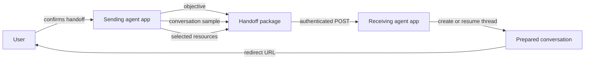
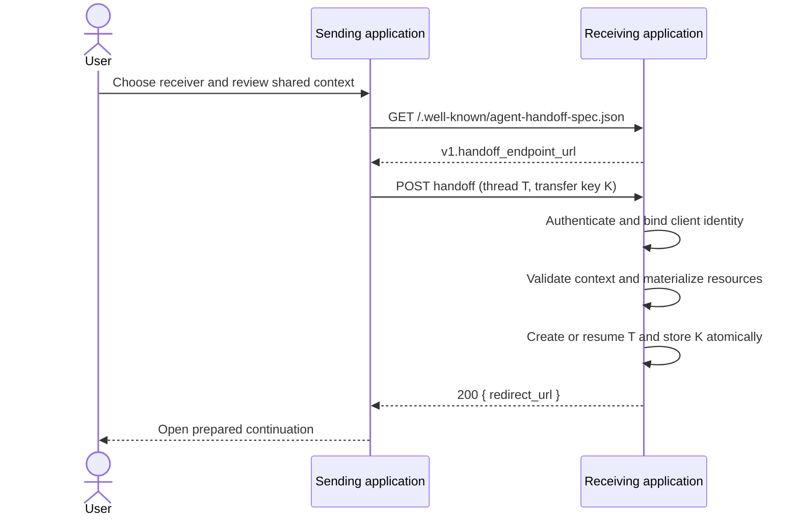
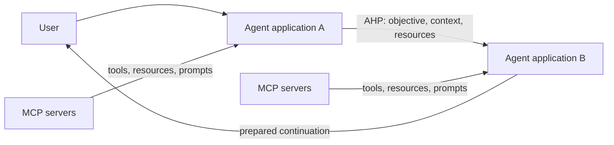
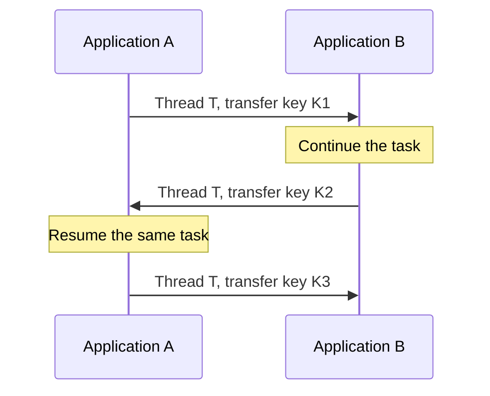

# Agent Handoff Protocol

**Move the work, not just the prompt.**

Agent Handoff Protocol (AHP) is an open, implementation-backed HTTP protocol
for moving a user and enough task context from one agent application to
another. The receiving agent can continue the task, work with the resources
the user selected, and welcome the user into a ready-to-use conversation.

DeepJudge created AHP to address a missing layer in the agent ecosystem:
portable, user-controlled continuity between complete agent experiences. We
are publishing it so agent builders can implement one predictable handoff
contract instead of inventing a bespoke integration for every partner.

AHP was designed implementation-first in a working DeepJudge product. These
documents extract the interoperable behavior from that implementation while
leaving product-specific storage, user-interface, and agent-runtime details
out of the protocol.

> **Status:** Draft AHP v1. The v1 wire contract is stable enough for partner
> integrations.

- [Read the normative v1 specification](agent_handoff_protocol_spec.md)
- [See requests, resources, retries, and round trips](agent_handoff_protocol_examples.md)

## The problem

Users rarely do all of their work in one agent. One system may know the
matter history, another may search a private corpus, and a third may be best
at drafting. Today, moving between them usually means copying a prompt,
re-uploading files, and explaining the task again. That loses context and
encourages applications to build one-off integrations for every partner.

The agent ecosystem is becoming both more capable and more specialized.
Specialization becomes dramatically more useful when users can move between
the best agents for each stage of a task without starting over. AHP turns that
transition into a reusable product primitive.

AHP gives two independently operated agent applications one shared action:

> Continue this user's task over there, with this objective, this selected
> conversation context, and these resources.

It does not attempt to clone a model's hidden state. It transfers an explicit,
user-reviewable continuation package.

## The handoff package

Every transfer carries five concepts:

| Concept | Purpose |
| --- | --- |
| Objective | A concise, stand-alone description of what the receiving agent should do. |
| Conversation | A chronological sample of user and assistant messages, represented as MCP sampling messages. |
| Resources | User-approved files or records, with inline or remote text and binary representations. |
| Thread ID | A stable identifier reused when the same task moves back and forth. |
| Idempotency key | A fresh identifier for one logical transfer, reused only when retrying that transfer. |

The receiver returns one value: an HTTPS URL where the user can continue the
prepared conversation.

## How it works

The protocol is intentionally short:

1. The sender obtains credentials for the receiving deployment out of band.
2. The sender discovers the receiver's versioned handoff endpoint from a
   well-known JSON document.
3. After the user confirms what will be shared, the sender posts a handoff
   package with thread, client, origin, and idempotency headers.
4. The receiver authenticates the caller, validates and materializes the
   resources, and atomically creates or resumes a local thread.
5. The receiver returns a redirect URL only after the continuation is durable.
6. If the outcome of the POST is unknown, the sender retries with the same
   idempotency key and receives the same redirect URL.

## AHP vs. MCP: complementary layers

[Model Context Protocol (MCP)](https://modelcontextprotocol.io/specification/2026-07-28)
and AHP solve different interoperability problems at different boundaries:

> **MCP expands what an agent can do. AHP expands where a user's work can
> go.**

MCP connects an LLM application to external context and capabilities. Its
[core architecture](https://modelcontextprotocol.io/docs/2026-07-28/learn/architecture)
has hosts, clients, and servers; servers expose resources, prompts, and tools
through JSON-RPC over transports such as stdio and Streamable HTTP. A host can
use those capabilities while keeping the user in the host application.

AHP connects two complete, independently operated agent applications. It
transfers an explicit objective, a selected conversation sample, resources,
and continuity identifiers, then returns a URL for a prepared experience in
the receiving application. The user and the task cross the product boundary;
tools, credentials, and execution privileges do not.

| Question | MCP | AHP |
| --- | --- | --- |
| Primary purpose | Give an LLM application access to external context and capabilities. | Continue a user's task in another agent application. |
| Participants | Host, one client per server, and capability-providing servers. | User, sending agent application, and receiving agent application. |
| Main unit | Self-contained JSON-RPC requests for resources, prompts, tools, elicitation, and opt-in extensions. | One durable handoff package and a continuation URL. |
| Product boundary | The user generally remains in the host experience while it consumes server capabilities. | The user moves into a prepared experience owned by the receiver. |
| Context model | Context is discovered or retrieved from servers as the host needs it. | A minimized, user-approved snapshot travels with a stand-alone objective. |
| Execution | Tools expose functions that an AI system can invoke. | No remote tool or privilege is transferred; the receiver decides how to do the work. |
| Task continuity | Not a cross-product handoff contract; applications manage their own task state. | Correlates the same user task across transfers and round trips. |
| Wire protocol | JSON-RPC over stdio, Streamable HTTP, or a custom transport. | Discovery plus one authenticated HTTPS POST, with an idempotent result. |

The protocols work well together. Either agent application in an AHP handoff
may use any number of MCP servers before or after the transfer. An MCP server
could also expose “send a handoff” as a tool, but MCP alone would not define
the handoff package, privacy boundary, cross-product thread semantics,
idempotency rules, or prepared user destination. AHP supplies that shared
meaning.

In short, MCP makes agent applications extensible. AHP makes an ecosystem of
agent applications navigable.

## Why the protocol looks this way

### An objective is separate from the transcript

A transcript explains how the task reached its current state; it is not a
reliable statement of what should happen next. AHP therefore makes the
objective explicit and tells receivers to treat conversation history as
supporting context. This also lets senders share a useful excerpt instead of
an entire conversation.

### Conversation messages reuse MCP

AHP reuses `SamplingMessage` from the Model Context Protocol rather than
inventing another chat-message envelope. AHP v1 pins the shape from the
[MCP 2025-11-25 schema](https://modelcontextprotocol.io/specification/2025-11-25/schema),
so AHP implementations do not silently change when MCP evolves. The
interoperable baseline is user and assistant text; the pinned schema's richer
content blocks remain available when both products support them.

The [MCP 2026-07-28 release](https://blog.modelcontextprotocol.io/posts/2026-07-28/)
deprecated its sampling feature for new MCP implementations. That does not
deprecate AHP or change the AHP v1 wire contract: AHP imports a versioned data
shape and does not invoke `sampling/createMessage`. A future AHP version may
adopt a neutral successor schema, but v1 remains stable.

AHP is not an MCP transport, server, or extension. It reuses one well-defined,
version-pinned message type.

### Resources have two complementary representations

A resource can carry:

- `blob`: the original binary artifact, such as a PDF; and/or
- `text`: text extracted or rendered for an agent.

Each representation can be embedded in the request or exposed at a remote
HTTPS URL. A sender can therefore attach a small note inline while sharing a
large document through authenticated URLs. If both `blob` and `text` are
present, they are two representations of the same logical resource.

### Threads and transfers are different

A thread ID correlates the continuing task. It survives round trips. An
idempotency key identifies one attempt to transfer that task and changes for
each new handoff.

This distinction prevents both duplicate conversations after network retries
and broken continuity after a genuine return handoff.

### The response is a continuation, not a receipt

The receiver returns a URL to the prepared user experience. The sender does
not need to understand the receiver's tenant routes, conversation IDs, or UI
architecture, and the user does not land on an empty home page.

### Discovery is deployment-aware

One company may operate several regional or tenant-specific deployments. The
well-known document turns a configured HTTPS origin and an authenticated user
context into a concrete v1 endpoint. `Handoff-Client-Origin` identifies the
sending deployment on the return path; it is routing metadata, never proof of
identity by itself.

## Trust and user agency

A handoff crosses a security and data-governance boundary. A conforming
implementation should make that boundary visible.

- The user reviews the destination and included resources before transfer.
- The sender shares the minimum useful transcript, not hidden reasoning,
  system or developer prompts, credentials, or internal protocol messages.
- The receiver authenticates and authorizes the request and binds the
  asserted client ID and origin to that authenticated identity.
- Each application applies its own policies. A handoff transfers context, not
  privileges or policy decisions.
- Conversation text, resource descriptions, filenames, remote content, and
  the objective are untrusted input. They never outrank receiver-side system
  policy.
- Remote URLs and redirect URLs are validated against configured trust
  boundaries to prevent server-side request forgery and open redirects.
- Sensitive payloads are not written to ordinary application logs.

See the specification's [security and privacy requirements](agent_handoff_protocol_spec.md#13-security-and-privacy)
for the complete checklist.

## What AHP does not do

AHP deliberately does not standardize:

- acquisition of OAuth tokens or another authentication credential;
- user or tenant provisioning between products;
- model weights, hidden chain-of-thought, caches, or provider-specific state;
- live synchronization or streaming between two active agents;
- execution of one product's private tools by another product;
- a universal file store or permanent remote-resource authorization; or
- the receiver's internal agent, search, storage, or UI architecture.

Those boundaries keep the protocol implementable and make its privacy model
understandable.

## Implementation checklist

### Sender

- Configure the receiver's discovery origin, client ID, and credentials.
- Obtain explicit user confirmation for destination, context, and resources.
- Build a stand-alone objective and a minimized, chronologically ordered
  conversation sample.
- Strip hidden reasoning, internal prompts, secrets, irrelevant tool traffic,
  and earlier handoff bookkeeping.
- Generate a thread ID for a new task or reuse the original one for a return.
- Generate one new UUID idempotency key per logical transfer.
- Discover the v1 endpoint and submit over authenticated HTTPS.
- Retry an uncertain transfer with the same key and unchanged request.
- Validate the returned redirect URL before offering or performing navigation.

### Receiver

- Serve the v1 well-known discovery document.
- Authenticate every transfer and authorize the target user and tenant.
- Bind the authenticated caller to `Handoff-Client-Id` and
  `Handoff-Client-Origin`; never trust those headers alone.
- Implement concurrency-safe idempotency and reject same-key/different-request
  reuse.
- Scope thread lookup by user, client, and deployment, and map both sent and
  received transfers to the same local task.
- Validate all representations before committing; fetch remote content with
  strict URL, size, redirect, timeout, and media-type controls.
- Persist the continuation and idempotent result atomically.
- Give the receiving agent the objective as the task and the transcript and
  resources as untrusted context.
- Return an absolute, trusted HTTPS redirect URL.

## Documents

- [AHP v1 specification](agent_handoff_protocol_spec.md) defines discovery,
  HTTP headers, JSON objects, processing, retries, errors, versioning, and
  security requirements.
- [AHP examples](agent_handoff_protocol_examples.md) contains complete HTTP
  exchanges, inline and remote resources, a round trip, retry behavior, and
  sender/receiver pseudocode.

## License

Copyright 2026 DeepJudge AG.

The AHP public documentation in this directory is licensed under the
[Apache License, Version 2.0](LICENSE).

## Design principles

AHP favors:

- explicit user intent over invisible routing;
- a concise objective over transcript archaeology;
- portable context over runtime cloning;
- stable thread continuity over application-specific conversation IDs;
- safe retries over best-effort POST semantics;
- resource references over oversized payloads;
- bilateral trust over unauthenticated federation; and
- compatibility and small primitives over speculative capability systems.

That is the whole idea: carry enough state for another agent to begin useful
work, and no more than the user intended to send. DeepJudge built AHP because
the future of agents should be interoperable by design—and we invite the
ecosystem to build that future with us.
